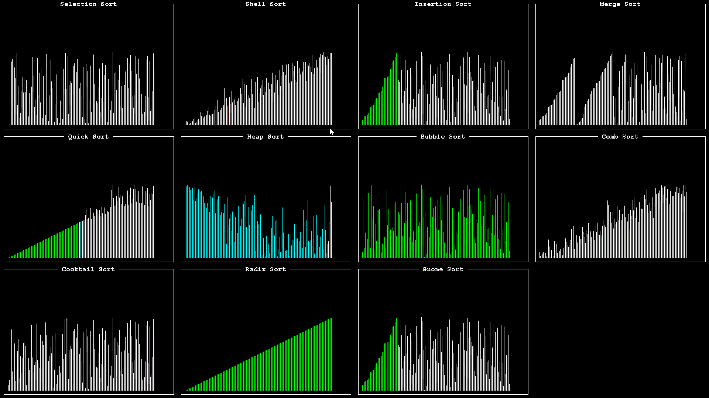

Sorting Algorithms
==========================

Visualization and comparison of 11 different sorting algorithms:
- selection sort
- shell sort
- insertion sort
- merge sort
- quick sort
- heap sort
- bubble sort
- comb sort
- cocktail sort
- gnome sort
- radix sort

The algorithms are run using 4 types of input data:
- random
- few unique
- reversed
- almost sorted

## License

See the [LICENSE](LICENSE.txt) file for license rights and limitations (MIT).

